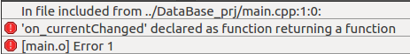
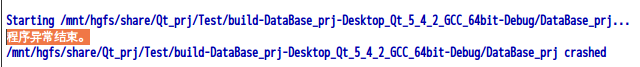

# 系统开发手册

```c
/* 现阶段实现功能最为重要 */
```

版本记录：

|    日期    | 修订版本 |    描述    | 作者 |
| :--------: | :------: | :--------: | :--: |
| 2021/10/28 |  1.0.0   |  项目设计  | xyq  |
| 2021/10/30 |  1.0.1   |  控件学习  | xyq  |
| 2021/11/02 |  1.0.2   | 模块化学习 | xyq  |

[TOC]

## 一、手册简介

### 1、基础

本文目的：记录基于Qt的XXXX项目开发过程中遇到的问题，以及项目的构思等

硬件平台：华清远见开发板FS4412

软件平台：Qt5.4.2(Linux)、qt-everywhere-opensource-src-5.3.1

工具链：gcc-4.6.4

参考文献：Qt 5.9 C++开发指南

### 2、构思

```c++
//👇以下只是初期的一个设计构思的记录
👉开发技术
基本控件使用：QComboBox、QCanlendar、QPainter、QtCharts、3D、音频控件、视频控件

动态背景
串口通信
多线程通信
多线程操作
TCP/IP传输

👉功能描述-车载设计

Step1：入口Widget→动态背景|ComBox框唤出不同的process
客户端	
	普通用户：注册、登入
	管理员：账户定全局变量,主函数赋值,可更改但只有一个管理员
服务器	
	唤出QSql，这个其实不应该从入口Widget进

Step2：停车系统|音乐播放器|视频观影器|
	 客户端：

Step3：|酒店预订|路径导航
```

### 3、资源

GitHub：git@github.com:Fry-tui/Qt_prj.git

## 二、基础控件

### 1、QWidget

#### 1.1、构造函数

```c++
QWidget(QWidget *parent = 0, Qt::WindowFlags f = 0);  
       其中参数 parent 指向父窗口，如果这个参数为 0，则窗口就成为一个顶级窗口
       参数 f 是构造窗口的标志，主要用于控制窗口的类型和外观等，有以下常用值。
       1）Qt::FramelessWindowHint：没有边框的窗口。
       2）Qt::WindowStaysOnTopHint：总是最上面的窗口。
       3）Qt::CustomizeWindowHint：自定义窗口标题栏，以下标志必须与这个标志一起使用才有效，否则窗口将有默认的标题栏。
       4）Qt::WindowTitleHint：显示窗口标题栏。
       5）Qt::WindowSystemMenuHint：显示系统菜单。
       6）Qt::WindowMinimizeButtonHint：显示最小化按钮。
       7）Qt::WindowMaximizeButtonHint：显示最大化按钮。
       8）Qt::WindowMinMaxbuttonHint：显示最小化按钮和最大化按钮。
       9）Qt::WindowCloseButtonHint：显示关闭按钮。
```

#### 1.2、判断窗口

```c++
一个窗口是否为独立窗口可用下面的成员函数来判断：
bool isWindow() const;     // 判断是否为独立窗口  

下面这个函数可以得到窗口部件所在的独立窗口。
QWidget *window() const;      // 所得所在的独立窗口  
当然，如果窗口本身就是独立窗口，那么得到的就是自己。

而下面这个函数可以得到窗口的父窗口：
QWidget *parentWidget() const;    // 得到父窗口  

```

#### 1.3、窗口设置

```c++

窗口标题
WindowTitle 属性表示窗口的标题，与之相关的成员函数如下：
QString windowTitle() const;    // 获得窗口标题  
void setWindowTitle(const QString &text);    // 设置窗口标题为 text 

几何参数
这里的几何参数指的是窗口的大小和位置。一个窗口有两套几何参数，一套是窗口外边框所占的矩形区域，另一套是窗口客户区所占的矩形区域。所谓窗口客户区就是窗口中去除边框和标题栏用来显示内容的区域。这两套几何参数分别由两个 QRect 型的属性代表，相关的成员函数如下：
const QRect &geometry() const;                 // 获取客户区几何参数  
void setGeometry(int x, int y, int w, int h);    // 设置客户取几何参数  
void setGeometry(const QRect &rect);         // 设置客户区几何参数  
QRect frameGeometry() const;                  // 获取外边框几何参数 

注意：不要在 moveEvent 或 resizeEvent 两个事件处理函数中设置几何参数，否则将导致无限循环 窗口的几何参数也可以由用户的操作改变，这时也会发送相应的事件。
    
为了方便使用，与几何参数相关的成员函数还有以下这些：
QPoint pos() const;     // 获得窗口左上角的坐标(外边框几何参数)  
QSize size() const;      // 窗口大小 （客户区几何参数）  
int x() const;                  // 窗口左上角横坐标 （外边框几何参数）  
int y() const;                  // 窗口左上角纵坐标 （外边框几何参数）  
int height() const;        // 窗口高度 （客户区几何参数）  
int width() const;          // 窗口宽度 （客户区几何参数） 

可以看出，坐标全部是外边框几何参数，而大小全部是客户区几何参数。要获得外边框的大小需要用下面这个成员函数：
QSize frameSize() const;    // 窗口大小 （外边框几何参数）  
  
改变这些属性可以用下面这些成员函数：
void move(int x, int y);    // 将窗口左上角移动到坐标（x,  y）处；  
void move(const QPoint &pos);     // 将窗口左上角移动到 pos 处；  
void resize(int w, int h);     // 将窗口的宽度改为 w， 高度改为 h  
void resize(const QSize &size);     // 将窗口的大小改为  size 

可见性与隐藏
可见性指的是窗口是否显示在屏幕上的属性。被其他
窗口暂时遮挡住的窗口也属于可见的。可见性由窗口的 visible 属性表示，与之相关的成员函数如下：
bool isVisible() const;    // 判断窗口是否可见  
bool isHidden() const;   // 判断窗口是否隐藏  
virtual void setVisible(bool visible);   // 设置窗口是否隐藏  
void setHidden(bool hidden);    // 等价于 setvisible(!hidedn);


bool isMinimized() const;     // 判断窗口是否为最小化  
bool isMaximized() const;    // 判断窗口是否为最大化  
bool isFullScreen() const;   // 判断窗口是否为全屏  
void showMinimized();         // 以最小化方式显示窗口，这是一个槽  
void showMaximized();        // 以最大化方式显示窗口，这是一个槽  
void showFullScreen();        // 以全屏方式显示窗口，这是一个槽  
void showNormal();              // 以正常方式显示窗口，这是一个槽 

注意后 4 个函数同时也是槽。全屏方式与最大化的区别在于：全屏方式下窗口的边框和标题栏消失，客户区占据整个屏幕。窗口的各种状态仅对独立窗口有效，对窗口部件来说没有意义。

另外还有一个 windowState 属性和窗口状态有关，相关的成员函数如下：
Qt::WindowStates windowState() const;                         // 获取窗口状态  
void setWindowState(Qt::WindowStates windowState);      // 设置窗口状态  
 
        这里的 Qt::WindowStates 类型有以下几个取值。
        1）Qt::WindowNoState：无标志，正常状态。
        2）Qt::WindowMinimized：最小化状态。
        3）Qt::WindowMaxmized：最大化状态。
        4）Qt::WindowFullScreen：全屏状态。
        5）Qt::WindowActive：激活状态。
 
        这里取值可以用 “按位或” 的方式组合起来使用。
        需要注意的是，调用 setWindowState 函数将使窗口变为隐藏状态。
         
        
	使能
	处于使能状态的窗口才能处理键盘和鼠标等输入事件，反之，处于禁用状态的窗口不能处理这些事件。窗口是否处于使能状态由属性 enabled 表示，相关成员函数如下：
 
bool isEnabled() const;     // 获得窗口的使能装态  
void setEnabled(bool enable);  // 设置窗口的使能状态，这是一个槽  
void setDisabled(bool disabled);     // 等价于 setEnabled(!disable)，这是一个槽  

//窗口移动
this->setPoreshs("canMove",true);//类似的一个东西,后续补全
```

### 2、QLineEdit

单行文本编辑控件，使用者可以通过很多函数，输入和编辑单行文本，比如撤销、恢复、剪切、粘贴以及拖放等。

```c++
我们可以使用 setText() 或者 insert() 改变其中的文本，通过 text() 获得文本，通过 displayText() 获得显示的文本，使用 setSelection() 或者 selectAll() 选中文本，选中的文本可以通过cut()、copy()、paste()进行剪切、复制和粘贴，使用 setAlignment() 设置文本的位置。

文本改变时会发出 textChanged() 信号；如果不是由setText()造成文本的改变，那么会发出textEdit()信号；鼠标光标改变时会发出cursorPostionChanged()信号；当返回键或者回车键按下时，会发出returnPressed()信号。

当编辑结束，或者LineEdit失去了焦点，或者当返回/回车键按下时，editFinished()信号将会发出。
```

#### 控件函数

```c++
//设置文本输入的位置
ui->Login_User_box->setAlignment(Qt::AlignCenter);

//当编辑结束，或者LineEdit失去了焦点，或者当返回/回车键按下时关联槽函数
connect(ui->Login_Pwd_box,SIGNAL(editingFinished()),this,SLOT(close()));

//设置文字提示(Placeholder:占位符)
ui->Login_User_box->setPlaceholderText("name");
ui->Login_Pwd_box->setPlaceholderText("pwd");

//设置输入模式
setEchoMode(QLineEdit::Normal);//默认
setEchoMode(QLineEdit::Password);//密码
setEchoMode(QLineEdit::PasswordEchoOnEdit);//编辑时输入字符显示输入内容，否则用小黑点代替
setEchoMode(QLineEdit::NoEcho);//任何输入都看不见

//设置只读
setReadOnly( false );

//设置输入数据类型
setValidator(0);//无限制
setValidator( new  QIntValidator(validatorLineEdit));//只能输入整数
//限制输入(只能输入-180到180之间的小数，小数点后最多两位)
QDoubleValidator *pDfValidator =  new  QDoubleValidator(-180.0, 180.0 , 2, validatorLineEdit);
pDfValidator->setNotation(QDoubleValidator::StandardNotation);
setValidator(pDfValidator);

//格式化输入
setInputMask( "" );//默认
setInputMask( "+99 99 99 99 99;_" );//下划线
setInputMask( "0000-00-00" );
setText( "00000000" );
setCursorPosition(0);//设置光标

//设置输入长度
setMaxLength(9);

//结合validator和inputmask

//获取文本
setText()                        #设置字符串
insert('插入的字符串')             #从光标处插入字符串  
text()                           #获取真是的文本字符
displayText()                    #获取用户能看到的字符串
    
//清空按钮
setClearButtonEnabled(True)  #设置清空按钮开启
isClearButtonEnabled()       #获取是否开启清空按钮

```

#### 自动补全

示例:补全邮箱后缀

```c++
//头文件
#include <QCompleter>
#include <QStandardItemModel>

namespace Ui {
class Widget;
}

class Widget : public QWidget
{
    Q_OBJECT

public:
    explicit Widget(QWidget *parent = 0);
    ~Widget();

private:
    Ui::Widget *ui;
    QStandardItemModel *m_model;
    QCompleter *m_completer;

private slots:
    void onEmailChoosed(const QString&);
    void onTextChanged(const QString&);
};

//源文件
 m_model = new QStandardItemModel(0, 1, this);
m_completer = new QCompleter(m_model, this);
ui->Login_User_box->setCompleter(m_completer);

void Widget::onEmailChoosed(const QString& email)
{
    ui->Login_User_box->clear();    // 清除已存在的文本更新内容
    ui->Login_User_box->setText(email);
}

void Widget::onTextChanged(const QString& str)
{
    if (str.contains("@"))   // 如果已经输入了@符号，我们就停止补全了。因为到了这一步，我们再补全意义也不大了。
    {
        return;
    }
    QStringList strlist;
    strlist << "@163.com" << "@qq.com" << "@gmail.com" << "@hotmail.com" << "@126.com";

    m_model->removeRows(0, m_model->rowCount());   // 先清楚已经存在的数据，不然的话每次文本变更都会插入数据，最后出现重复数据
    for (int i = 0; i < strlist.size(); ++i)
    {
        m_model->insertRow(0);
        m_model->setData(m_model->index(0, 0), str + strlist.at(i));
    }
}
```

#### 自动联想

```c++
QStringList list;
list << "Hi" << "Hello" << "Hey";

QCompleter *completer = new QCompleter(list);

line = new QLineEdit(this);
line->setCompleter(completer);
```

#### 编辑功能

```cmd
QLineEdit.backspace()  # 删除光标左侧字符或选中的文本
QLineEdit.del_()  # 删除光标右侧字符或选中文本
QLineEdit.cQLineEditar()  # 删除文本框所有内容
QLineEdit.copy()
QLineEdit.cut()
QLineEdit.paste()
QLineEdit.isUndoAvailabQLineEdit()  # 是否可执行撤销动作
QLineEdit.undo()
QLineEdit.isRedoAvailabQLineEdit()  # 是否可执行重做动作
QLineEdit.redo()
QLineEdit.setDragEnabQLineEditd(True)  # 设置文本可拖放
QLineEdit.seQLineEditctAll()
```

#### 自定义行为

```c++
QAction * action = new QAction(ui->Login_Pwd_box);
action->setIcon(QIcon("://visual.png"));
ui->Login_Pwd_box->addAction(action,QLineEdit::TrailingPosition);
//QLineEdit.TrailingPosition     #在文本框后端显示图标
//QLineEdit.LeadingPosition      #在文本框前端显示图标
def change_action():
    pass
action.triggered.connect(change_action)   #行为触发程序
        

```

#### 密码眼睛

参考网址：https://zhuanlan.zhihu.com/p/335517807；


### 3、QLabe

#### 图片添加

```c++
//框图
QImage image("://user.png");
QPixmap px = QPixmap::fromImage(image);
//图片缩放：w, h为宽高
px = px.scaled(200, 200, Qt::KeepAspectRatio, Qt::SmoothTransformation);
ui->portrait->setPixmap(px);


    ui->portrait->setText("");

ui->rpLabel->setText("picName+"\" alt=\"Image read error!\" height=\"128\" width=\"128\" />");


//背景图
ui->setupUi(this);
this->resize(1020,640);
ui->backLabel->setScaledContents(true);
//QPalette palette;
//QPixmap pixmap("/car_main.gif");
//pixmap = pixmap.scaled(this->width(),this->height());
//palette.setBrush(backgroundRole(),QBrush(pixmap));
//this->setPalette(palette);  //图片尺寸要和widget等大小 如果图片尺寸小  就会重复排列

//ui->gif->setScaledContents(true);
QMovie *iconShow = new QMovie(":/back/car/car_1");

//palette.setBrush(backgroundRole(),QBrush(iconShow));
//ui->gif->setMovie(iconShow);
//this->setPalette(palette);  //图片尺寸要和widget等大小 如果图片尺寸小  就会重复排列
ui->backFrame->resize(this->size());
ui->backLabel->resize(this->size());
ui->backFrame->setStyleSheet( "background: rgb(0, 0, 0, 0)");


ui->backLabel->setMovie(iconShow);
iconShow->start();
ui->setupUi(this);
this->resize(1020,640);
ui->backLabel->setScaledContents(true);

//ui->gif->setScaledContents(true);
QMovie *iconShow = new QMovie(":/back/car/car_1");
ui->backFrame->resize(this->size());
ui->backLabel->resize(this->size());
ui->backFrame->setStyleSheet( "background: rgb(0, 0, 0, 0)");

ui->backLabel->setMovie(iconShow);
iconShow->start();
```

### 4、QStackedWidget

#### 4.1、方法

```c++
//页面切换
setCurrentIndex(0);

//页面添加
int addWidget(QWidget * widget);//返回索引

//页面计数
int count() const;
    
//获取当前页面的索引
int currentIndex() const;

//获取当前页
QWidget * currentWidget() const;

```

#### 4.2、信号

```c++
//页面切换信号
void currentChanged(int index);//index:新页面的索引值

//页面移除
void widgetRemoved(int index);//被移除的页面
```

#### 4.3、槽

```c++
//设置当前页
void setCurrentIndex(int index);
void setCurrentWidget(QWidget * widget);
```


## 三、功能模块

### 1、Qss样式

#### 1.2、用法格式

```css
QLineEdit#Login_Pwd_box{
    /* 外边框: */
    border:2px solid #0021ff;

    /* 倒角 */
    border-radius: 30px;

    /*  内边框:上下和左右的距离*/
    padding: 10 8px;

    /* 背景色 */
    background: #00fff7;

    /* 选中高亮背色 */
    selection-background-color:blue;
    min-width:200px;
    min-height:40px;
}

QLineEdit#Login_User_box{
    /* 外边框:border:2px solid #ff9933; */


    /* 倒角 */
    border-radius: 50px;

    /*  内边框:上下和左右的距离*/
    padding: 10 8px;

    /* 背景色 */
    background: #ff6633;

    /* 选中高亮背色 */
    selection-background-color:blue;
    min-width:200px;
    min-height:40px;
}

/* 密码模式 */
QLineEdit[echoMode="2"] {
    lineedit-password-character:9679;
}

/* 当是只读模式时 */
QLineEdit:read-only {
    background:red;
}

```

#### 1.3、引用方式

```c++
QFile qss("://login.qss");

if( qss.open(QFile::ReadOnly)){
    qDebug("open success");
    QString style = QLatin1String(qss.readAll());
    //a.setStyleSheet(style);
    this->setStyleSheet(style);
    qss.close();
}else{
    qDebug("Open failed");
}
```


### 2、QSqlite

#### 2.1、数据操作

```c++
//打开数据库
void MainWindow::on_actionActOpenDB_triggered()
{
//打开数据表
    QString aFile=QFileDialog::getOpenFileName(this,"选择数据库文件","","SQL Lite数据库(*.db *.db3)");
    
    if (aFile.isEmpty())  //选择SQL Lite数据库文件
       return;

//打开数据库
    DB=QSqlDatabase::addDatabase("QSQLITE"); //添加 SQL LITE数据库驱动
    DB.setDatabaseName(aFile); //设置数据库名称
//    DB.setHostName();
//    DB.setUserName();
//    DB.setPassword();
    if (!DB.open())   //打开数据库
    {
        QMessageBox::warning(this, "错误", "打开数据库失败",QMessageBox::Ok,QMessageBox::NoButton);
        return;
    }

//打开数据表
    openTable();
}

//打开数据表
void MainWindow::openTable()
{//打开数据表
    tabModel=new QSqlTableModel(this,DB);//数据表
    tabModel->setTable("garage"); //指定数据表
    tabModel->setEditStrategy(QSqlTableModel::OnManualSubmit);//数据保存方式，OnManualSubmit , 
    tabModel->setSort(tabModel->fieldIndex("Name"),Qt::AscendingOrder); //排序

    if (!(tabModel->select()))//查询数据
    {
       QMessageBox::critical(this, "错误信息",
              "打开数据表错误,错误信息\n"+tabModel->lastError().text(),
                 QMessageBox::Ok,QMessageBox::NoButton);
       return;
    }

//字段显示名
    tabModel->setHeaderData(tabModel->fieldIndex("Name"),Qt::Horizontal,"username");
    tabModel->setHeaderData(tabModel->fieldIndex("Pwd"),Qt::Horizontal,"password");
    tabModel->setHeaderData(tabModel->fieldIndex("CardID"),Qt::Horizontal,"CarId");

    theSelection=new QItemSelectionModel(tabModel);//关联选择模型
//单元格变化时触发函数on_currentChanged()
    connect(theSelection,SIGNAL(currentChanged(QModelIndex,QModelIndex)),
            this,SLOT(on_currentChanged(QModelIndex,QModelIndex)));
//选择行变化时，触发函数on_currentRowChanged()
    connect(theSelection,SIGNAL(currentRowChanged(QModelIndex,QModelIndex)),
            this,SLOT(on_currentRowChanged(QModelIndex,QModelIndex)));

    ui->tableView->setModel(tabModel);//设置数据模型
    ui->tableView->setSelectionModel(theSelection); //设置选择模型
    ui->tableView->setColumnHidden(tabModel->fieldIndex("Memo"),true);//隐藏列
    ui->tableView->setColumnHidden(tabModel->fieldIndex("Photo"),true);//隐藏列

}

//单元格发生状态改变的时候需要使能提交和撤销两个按钮，作用不大
void MainWindow::on_currentChanged(const QModelIndex &current, const QModelIndex &previous)
{
    //ui->actSubmit->setEnabled(tabModel->isDirty()); //有未保存修改时可用
    //ui->actRevert->setEnabled(tabModel->isDirty());
    return;
}

//当前行发生变化时需要做的操作，目前我只需要用到photo
void MainWindow::on_currentRowChanged(const QModelIndex &current, const QModelIndex &previous)
{
    if(!current.isValid()){
        ui->photo->clear();
        return;
    }
    
    //❌dataMapper->setCurrentIndex(current.row()); //update数据映射的行号
    
    int curRecNo = current.row();
    QSqlRecord curRec = tabModel->record(curRecNo);
    if(curRec.isNull("Photo"))
        ui->photo->clear();
    else{
        QByteArray data = curRec.value("Photo").toByteArray();
        QPixmap pic;
        pic.loadFromData(data);
        ui->photo->setPixmap(pic.scaledToWidth(ui->photo->size().width()));
    }
    return;
}
```

#### 2.2、QSqlTableModel

```c++
tabModel->setSort(排序字段列号,排序方式); //排序	Qt::AscendingOrder升		Qt::DescendingOrder降

QSqlTableModel *tabModel;           //table
tabModel->setHeaderData(tabModel->fieldIndex("Name"),Qt::Horizontal,"username");	
//filedIndex(QString):根据字段名称返回其在模型中的字段符号，若字段不存在则返回-1
//setHeaderData(表中的字段号,布局方向,"需要设置的表头"):设置表头

//编辑策略
setEditStrategy(QSqlTableModel::OnManualSubmit);
QSqlTableModel::OnFieldChange		任意更改实时保存
QSqlTableModel::OnRowChange			单行更改实时保存
QSqlTableModel::OnManualSubmit		手动保存
```

### 3、OpenCV

```c++

```

## 四、通信框架

Tcp/IP框架

```c++
//server

```

```c++
//client

```

## 五、功能设计


## 六、代码实现


## 七、报错日志

### 1、declared as function returning a function

报错信息：

​	

```c++
//源码
private slots:
    void on_currentChanged()(const QModelIndex &current, const QModelIndex &previous);
    void on_currentRowChanged(const QModelIndex &current, const QModelIndex &previous);

//修正
private slots:
    void on_currentChanged(const QModelIndex &current, const QModelIndex &previous);
    void on_currentRowChanged(const QModelIndex &current, const QModelIndex &previous);

//问题是我多打了一对括号，但是不好发现，因为报错提示是返回值有问题
```

### 2、warning: unused parameter ‘arg1′ [-Wunused-parameter]

```c++
//当参数未使用到的时候报⚠的两种解决办法

1、Q_UNUSED(arg1);//Q_UNUSED() 没有实质性的作用，用来避免编译器警告
2、QMAKE_CXXFLAGS +=  -Wno-unused-parameter
```

### 3、程序异常结束

​	

运行程序突然崩溃，通过注释代码，锁定问题在一个指针的使用上，但是不知道问题出在哪里，后来发现是指针没有new一片空间。

### 4、依赖: libept0 (>= 0.5.26ubuntu2) 但是它将不会被安装

【未解决】:暂时还原虚拟机快照

```cmd
//报错代码
下列软件包有未满足的依赖关系：
 aptitude : 依赖: libapt-pkg-libc6.10-6-4.8
            依赖: libept0 (>= 0.5.26ubuntu2) 但是它将不会被安装
            推荐: libparse-debianchangelog-perl 但是它将不会被安装
E: 无法修正错误，因为您要求某些软件包保持现状，就是它们破坏了软件包间的依赖关系。

下列软件包有未满足的依赖关系：
 g++ : 依赖: g++-4.4 (>= 4.4.1-1) 但是它将不会被安装
       依赖: gcc-4.4 (>= 4.4.1-1) 但是它将不会被安装
E: 无法修正错误，因为您要求某些软件包保持现状，就是它们破坏了软件包间的依赖关系。
```

参考网址1：https://blog.csdn.net/S_1024S/article/details/104725928

参考网址2：https://blog.csdn.net/c_qianbo/article/details/51175132

### 5、qt_sql_default_connection' is still in use

```c++
//问题源码
	db = QSqlDatabase::addDatabase("QSQLITE");
	db.setDatabaseName("login.db");
	if(!db.isOpen()){
    	db.open();
    }

//修正代码
	if(QSqlDatabase::contains("qt_sql_default_connection"))
        db = QSqlDatabase::database("qt_sql_default_connection");
    else
        db = QSqlDatabase::addDatabase("QSQLITE");

    db.setDatabaseName("login.db");
    db.open();

//问题描述:每次调用数据库操作类就会提示链接已存在请勿重复连接,加了isOpen()的判断也是没有用,后来才知道要判断的不是db是否open
```


## 八、移植步骤

## 附录

开发日志

| Version | Author | Date     | Message                                          |
| ------- | ------ | -------- | ------------------------------------------------ |
| 00001   | 许玉泉 | 21/10/28 | [Ready]功能设计,项目构思                         |
| 00002   | 许玉泉 | 21/10/29 | [Ready]控件学习,通信原理学习                     |
| 00003   | 许玉泉 | 21/10/30 | [Ready]数据库学习                                |
| 00004   | 许玉泉 | 21/11/01 | [Ready]控件学习,自定义控件                       |
| 00005   | 许玉泉 | 21/11/02 | [Ready]自定义信号学习,页面操作学习               |
| 00006   | 许玉泉 | 21/11/03 | [Ready]TCP学习                                   |
| 00007   | 许玉泉 | 21/11/03 | [Project]服务器搭建,数据库合入,控件提取,页面预留 |
| 00008   | 许玉泉 |          | [Project]客户端页面搭建,摄像头预留,数据预留      |

